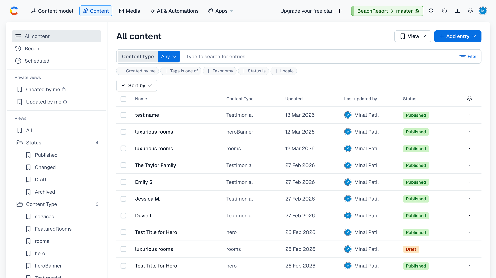

This is the Next.js starter site (and course files) for the Next.js & Contentful tutorial by the Net Ninja.

## Getting Started

To use the starter project, run the following in a terminal:

```bash
nvm use v14.17.1
npx create-next-app [contentful-demo] -e [https://github.com/Minal-Bharambe/Contentful-and-nextJs.git]
```
# 🌴 Beach Resort Website (Next.js + Contentful)

## 🚀 Project Overview

This project is a **modern, scalable beach resort website** built using **Next.js** and **Contentful (Headless CMS)**.

It demonstrates:

* Dynamic page rendering
* API-driven content management
* Component-based architecture
* SEO-friendly and performant frontend

---

## 🧠 Tech Stack

* **Frontend:** Next.js, React
* **CMS:** Contentful
* **Styling:** CSS / Tailwind (update based on yours)
* **API:** Contentful Delivery API
* **Deployment:** (Add Vercel / Netlify if deployed)

---

## ✨ Features

* 📄 Dynamic page routing
* 🧩 Reusable UI components
* 🔄 API-based data fetching (Contentful)
* ⚡ Optimized performance with SSR / SSG
* 🔍 SEO-friendly pages
* 📱 Fully responsive design
* 🎯 Modular and scalable architecture

---

## 📸 Screenshots

### 🏠 Home Page


### 🏖️ Resort Details Page


### 📦 Contentful CMS Dashboard



---

## 🏗️ Architecture

### 🔹 High-Level Flow

```
User → Next.js App → Contentful API → Render UI
```

### 🔹 Detailed Flow

1. User requests a page
2. Next.js fetches data via Contentful API
3. Data is processed in server-side / static props
4. UI components render dynamically
5. Page is delivered with SEO optimization

---

## 📂 Folder Structure

```
/components     → Reusable UI components
/pages          → Application routes (Next.js routing)
/lib            → API & utility functions
/styles         → Global styles
/screenshots    → Project images
```

---

## 🔌 API Integration (Contentful)

* Used Contentful SDK / REST API
* Structured content models:

  * Resort
  * Rooms
  * Offers
* Data fetched using:

  * `getStaticProps`
  * `getServerSideProps`

---

## 🧪 Key Learning Highlights

* Headless CMS integration (Contentful)
* SSR vs SSG in Next.js
* Component reusability & scalability
* API design and data modeling
* Performance optimization

---

## ⚙️ Setup Instructions

```bash
# Clone repo
git clone [https://github.com/Minal-Bharambe/Contentful-and-nextJs.git]

# Install dependencies
npm install

# Run project
npm run dev
```

---

## 🔐 Environment Variables

Create `.env.local`:

```
CONTENTFUL_SPACE_ID=your_space_id
CONTENTFUL_ACCESS_TOKEN=your_token
```

---

## 🚀 Future Enhancements

* 🛒 Booking system integration
* 💳 Payment gateway
* 🌐 Multi-language support
* 📊 Analytics integration

---
